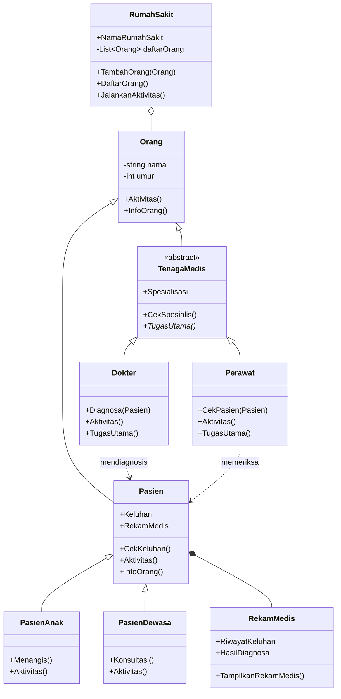
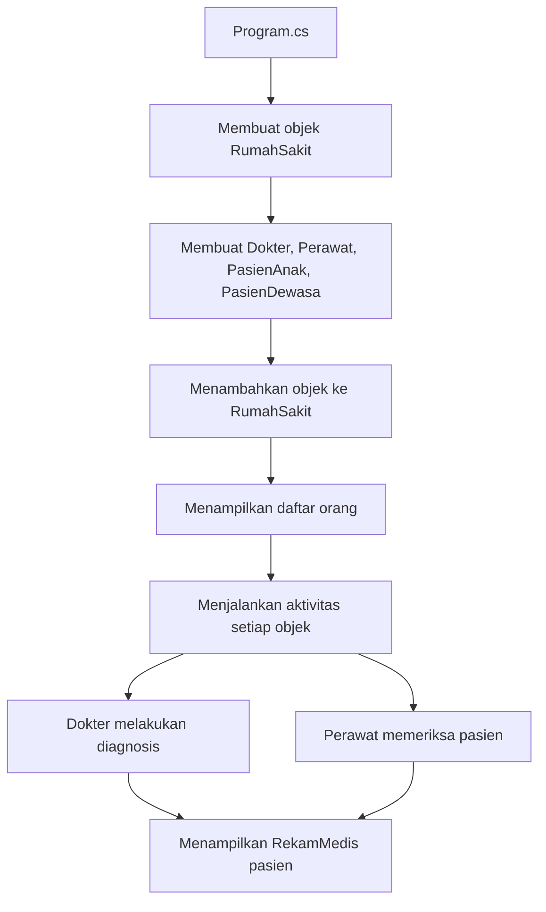

# Sistem Informasi Rumah Sakit

Program konsol C# untuk mensimulasikan pengelolaan data orang di lingkungan rumah sakit. Program membedakan **tenaga medis** dan **pasien**, menyimpan data dasar masing-masing, lalu menjalankan aktivitas sesuai peran mereka.

Selain itu, program memperlihatkan bagaimana dokter melakukan diagnosis, perawat memeriksa pasien, dan setiap pasien memiliki rekam medis untuk mencatat keluhan serta hasil diagnosis.
---

## Daftar Isi

1. [Gambaran Program](#gambaran-program)
2. [Struktur Project](#struktur-project)
3. [Hubungan Antarclass](#hubungan-antarclass)
4. [Penjelasan Class](#penjelasan-class)
5. [Konsep OOP yang Diterapkan](#konsep-oop-yang-diterapkan)
6. [Alur Kerja Program](#alur-kerja-program)
7. [Catatan Implementasi](#catatan-implementasi)
8. [Menjalankan Program](#menjalankan-program)

---

## Gambaran Program

| Bagian | Class | Tanggung jawab |
|---|---|---|
| Data orang | `Orang` | Menyimpan nama dan umur |
| Tenaga medis | `TenagaMedis`, `Dokter`, `Perawat` | Menangani data dan tugas dokter serta perawat |
| Pasien | `Pasien`, `PasienAnak`, `PasienDewasa` | Menyimpan identitas, keluhan, dan rekam medis |
| Rekam medis | `RekamMedis` | Mencatat riwayat keluhan dan hasil diagnosis |
| Rumah sakit | `RumahSakit` | Mengelola daftar orang dan menjalankan aktivitas mereka |
| Program utama | `Program` | Membuat objek, memasukkan data, dan menjalankan seluruh proses |

---

## Struktur Project

```text
tugas-praktikum/
├── Program.cs
├── Orang.cs
├── TenagaMedis.cs
├── Dokter.cs
├── Perawat.cs
├── Pasien.cs
├── PasienAnak.cs
├── PasienDewasa.cs
├── RekamMedis.cs
└── RumahSakit.cs
```

| File | Peran | Jenis class |
|---|---|---|
| `Orang.cs` | Class dasar semua orang | Base class |
| `TenagaMedis.cs` | Dasar untuk dokter dan perawat | Abstract class |
| `Dokter.cs` | Melakukan diagnosis | Turunan `TenagaMedis` |
| `Perawat.cs` | Memeriksa pasien | Turunan `TenagaMedis` |
| `Pasien.cs` | Dasar untuk pasien anak dan dewasa | Turunan `Orang` |
| `PasienAnak.cs` | Pasien anak | Turunan `Pasien` |
| `PasienDewasa.cs` | Pasien dewasa | Turunan `Pasien` |
| `RekamMedis.cs` | Catatan kesehatan pasien | Class biasa |
| `RumahSakit.cs` | Pengelola daftar orang | Class biasa |
| `Program.cs` | Titik awal program | Entry point |

---

## Hubungan Antarclass

### Diagram pewarisan dan relasi



### Ringkasan relasi

| Class | Relasi | Class tujuan | Penjelasan |
|---|---|---|---|
| `TenagaMedis` | Mewarisi | `Orang` | Tenaga medis adalah seorang manusia dengan nama dan umur |
| `Pasien` | Mewarisi | `Orang` | Pasien juga memiliki nama dan umur |
| `Dokter`, `Perawat` | Mewarisi | `TenagaMedis` | Memiliki spesialisasi dan wajib menjelaskan tugas utama |
| `PasienAnak`, `PasienDewasa` | Mewarisi | `Pasien` | Perilaku berbeda, data dasar sama |
| `Pasien` | Memiliki (composition) | `RekamMedis` | Setiap pasien punya rekam medisnya sendiri |
| `RumahSakit` | Menyimpan (aggregation) | `Orang` | Daftar bertipe `Orang` bisa menampung semua turunannya |
| `Dokter` | Menggunakan | `Pasien` | Menerima pasien sebagai parameter saat diagnosis |
| `Perawat` | Menggunakan | `Pasien` | Menerima pasien sebagai parameter saat pemeriksaan |

---

## Penjelasan Class

### 1. `Orang.cs`

Class dasar untuk informasi umum seseorang. Dipakai sebagai induk dari pasien dan tenaga medis.

| Anggota | Tipe | Keterangan |
|---|---|---|
| `nama` | Field private + property | Nama seseorang |
| `umur` | Field private + property | Umur seseorang |
| `Aktivitas()` | Method virtual | Menampilkan aktivitas dasar, dapat ditimpa class turunan |
| `InfoOrang()` | Method virtual | Menampilkan informasi orang, dapat disesuaikan dengan jenis objek |

### 2. `TenagaMedis.cs`

Merepresentasikan orang yang bekerja sebagai tenaga medis. Bersifat **abstract** karena tugas utama harus dijelaskan lebih spesifik oleh dokter dan perawat.

| Anggota | Tipe | Keterangan |
|---|---|---|
| `Spesialisasi` | Property | Bidang atau keahlian tenaga medis |
| `CekSpesialis()` | Method | Menampilkan spesialisasi |
| `TugasUtama()` | Method abstract | Wajib diimplementasikan oleh setiap turunan |

### 3. `Dokter.cs`

Turunan `TenagaMedis` yang menangani diagnosis pasien.

| Method | Parameter | Fungsi |
|---|---|---|
| `Diagnosa(Pasien pasien)` | Objek `Pasien` | Menampilkan proses diagnosis, lalu menyimpan hasilnya ke rekam medis pasien |
| `Aktivitas()` | - | Menampilkan aktivitas dokter |
| `TugasUtama()` | - | Menjelaskan tugas utama dokter |

Dokter menerima objek `Pasien` sebagai parameter, sehingga tidak perlu menyimpan seluruh data pasien di dalam class `Dokter`.

### 4. `Perawat.cs`

Turunan `TenagaMedis` dengan tugas berbeda dari dokter.

| Method | Parameter | Fungsi |
|---|---|---|
| `CekPasien(Pasien pasien)` | Objek `Pasien` | Menampilkan informasi pemeriksaan atau kondisi pasien |
| `Aktivitas()` | - | Menampilkan aktivitas perawat |
| `TugasUtama()` | - | Menjelaskan tugas utama perawat |

`CekPasien()` saat ini hanya menampilkan informasi dan belum mengubah status atau data kesehatan pasien.

### 5. `Pasien.cs`

Menyimpan informasi seseorang yang sedang mendapat pelayanan kesehatan. Mewarisi nama dan umur dari `Orang`.

| Anggota | Tipe | Keterangan |
|---|---|---|
| `Keluhan` | Property | Keluhan yang dirasakan pasien |
| `RekamMedis` | Property (objek) | Menyimpan riwayat keluhan dan hasil diagnosis |
| `CekKeluhan()` | Method | Menampilkan keluhan pasien |
| `Aktivitas()` | Method override | Menampilkan aktivitas pasien |
| `InfoOrang()` | Method override | Menampilkan informasi pasien beserta data yang relevan |

Saat objek pasien dibuat, objek `RekamMedis` ikut dibuat, sehingga setiap pasien memiliki rekam medisnya sendiri.

### 6. `PasienAnak.cs` dan `PasienDewasa.cs`

Dua jenis pasien dengan perilaku berbeda, tetapi sama-sama memakai data dasar dari `Pasien`.

| Class | Method khusus | `Aktivitas()` |
|---|---|---|
| `PasienAnak` | `Menangis()` untuk menggambarkan perilaku pasien anak | Ditulis ulang sesuai pasien anak |
| `PasienDewasa` | `Konsultasi()` untuk menampilkan aktivitas konsultasi | Ditulis ulang sesuai pasien dewasa |

### 7. `RekamMedis.cs`

Menyimpan informasi kesehatan pasien yang dicatat oleh program.

| Anggota | Nilai awal | Keterangan |
|---|---|---|
| `RiwayatKeluhan` | `"Belum ada"` | Riwayat keluhan pasien |
| `HasilDiagnosa` | `"Belum ada"` | Hasil diagnosis dokter, diisi saat `Dokter.Diagnosa()` dijalankan |
| `TampilkanRekamMedis()` | - | Menampilkan isi rekam medis |

### 8. `RumahSakit.cs`

Mengelola objek yang terdaftar dalam sistem.

| Anggota | Keterangan |
|---|---|
| `NamaRumahSakit` | Nama rumah sakit |
| `daftarOrang` | Daftar objek bertipe `Orang` |
| `TambahOrang(Orang orang)` | Menambahkan objek ke daftar |
| `DaftarOrang()` | Menampilkan informasi seluruh objek yang terdaftar |
| `JalankanAktivitas()` | Memanggil `Aktivitas()` dari setiap objek di dalam daftar |

Karena daftar bertipe `Orang`, daftar ini bisa menampung dokter, perawat, pasien anak, maupun pasien dewasa. Saat aktivitas dijalankan, implementasi `Aktivitas()` yang dipanggil mengikuti jenis objek sebenarnya.

### 9. `Program.cs`

Titik awal program. Di sinilah objek dibuat dan interaksi antarclass dijalankan.

| Langkah | Proses |
|---|---|
| 1 | Membuat objek rumah sakit |
| 2 | Membuat objek dokter dan perawat |
| 3 | Membuat objek pasien anak dan pasien dewasa beserta keluhannya |
| 4 | Menambahkan semua objek ke daftar rumah sakit |
| 5 | Menampilkan daftar orang yang terdaftar |
| 6 | Menjalankan aktivitas setiap objek |
| 7 | Menjalankan diagnosis dokter dan pemeriksaan perawat |
| 8 | Menampilkan keluhan dan rekam medis pasien |
| 9 | Menunjukkan bahwa objek perawat tetap menjalankan aktivitasnya sendiri ketika diakses lewat variabel bertipe `Orang` |

---

## Konsep OOP yang Diterapkan

| Konsep | Penerapan di project | Contoh |
|---|---|---|
| Encapsulation | Field private dengan property | `nama` dan `umur` di `Orang` |
| Inheritance | Pewarisan beberapa tingkat | `Orang` -> `TenagaMedis` -> `Dokter` |
| Abstraction | Class abstract dengan method abstract | `TenagaMedis.TugasUtama()` |
| Polymorphism | Method yang ditimpa dan dipanggil lewat tipe induk | `Aktivitas()` pada `List<Orang>` |
| Composition | Objek dibuat dan dimiliki oleh objek lain | `Pasien` memiliki `RekamMedis` |
| Dependency | Objek diberikan sebagai parameter | `Dokter.Diagnosa(Pasien)` |

---

## Alur Kerja Program



Versi teks:

```text
Program.cs
    |
    v
Membuat objek RumahSakit
    |
    v
Membuat Dokter, Perawat, PasienAnak, dan PasienDewasa
    |
    v
Menambahkan objek ke RumahSakit
    |
    v
Menampilkan daftar orang
    |
    v
Menjalankan aktivitas setiap objek
    |
    v
Dokter melakukan diagnosis  /  Perawat memeriksa pasien
    |
    v
Menampilkan RekamMedis pasien
```

---

## Catatan Implementasi

| No | Catatan | Dampak | Kemungkinan pengembangan |
|---|---|---|---|
| 1 | `Keluhan` pada `Pasien` dan `RiwayatKeluhan` pada `RekamMedis` adalah properti terpisah | Keluhan belum otomatis tersalin ke rekam medis | Salin nilai keluhan ke `RiwayatKeluhan` saat pasien dibuat atau diperiksa |
| 2 | `Perawat.CekPasien()` hanya menampilkan informasi | Data pasien tidak berubah setelah pemeriksaan | Tambahkan pencatatan hasil pemeriksaan ke rekam medis |
| 3 | Data hanya disimpan selama program berjalan | Semua data hilang setelah program ditutup | Simpan ke file atau database |

---

## Menjalankan Program

| Langkah | Tindakan |
|---|---|
| 1 | Buka solution project di Visual Studio |
| 2 | Pastikan project yang dipilih sebagai startup project adalah project utama yang berisi `Program.cs` |
| 3 | Jalankan dengan tombol **Start** atau tekan **F5** |
| 4 | Lihat hasil di jendela terminal |

---

Project ini dibuat sebagai latihan pemrograman berorientasi objek dengan studi kasus pengelolaan orang, tenaga medis, pasien, dan rekam medis pada rumah sakit.
